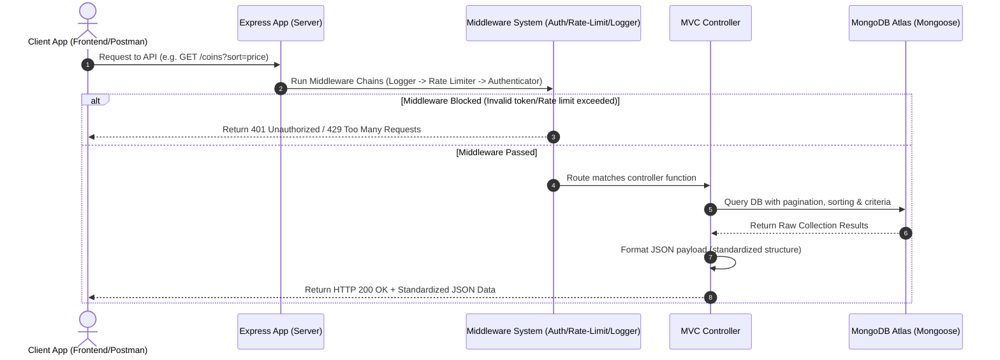

# 🪙 Crypto Market Analytics API

A professional-grade, scalable, and feature-rich Node.js RESTful API designed to ingest, process, query, and analyze 365 days of cryptocurrency historical data. Built using the **MVC architecture**, this backend integrates JWT authentication, role-based access control, custom middlewares, pagination, sorting, search, MongoDB aggregation pipelines, and robust validation.

---

## 🚀 Key Features

* 📊 **Exhaustive CRUD Endpoints**: Ingest, retrieve, replace, update, and delete individual/bulk cryptocurrency records.
* 🔍 **Advanced Filtering, Sorting & Pagination**: Robust query parser for complex filtering, customizable field projections, multi-criteria sorting, and page-based pagination.
* 📈 **MongoDB Aggregation Framework**: Multi-stage aggregation pipelines for computing highest/lowest/average price and volume, spikes detection, and statistical distribution computations.
* 🔐 **Secure JWT-Based Authentication**: Registration, email verification, login, logout, password reset, token refreshing, and route protection.
* 🛡️ **Custom Middlewares & Security**: Custom request logger, strict rate-limiter, CORS configurations, role-based access control (RBAC), and centralized global error handling.
* ⚡ **Performance Optimized**: Structured schema validations, database indexes for highly queried fields (e.g. rank, price, coin symbol, timestamps), and data validation.
* 🔌 **API Standards**: Full support for standard HTTP methods (including HEAD and OPTIONS) and consistent JSON response payloads.

---

## 📂 Project Structure

The project strictly follows the **MVC (Model-View-Controller)** pattern for clean separation of concerns and scaling:

```text
backend/
├── config/             # Configuration files (Database connection, environments)
├── controllers/        # Controllers (Handles HTTP request and response logic)
├── middlewares/        # Custom middlewares (Auth, Logger, Rate-limiting, Error handler)
├── models/             # Mongoose Schemas and Models (Data structure & constraints)
├── routes/             # Express routing system (Aggregates endpoint categories)
├── services/           # Business logic layer (Direct database queries & calculations)
├── project_phases.md   # Step-by-step roadmap and checklist tracker
└── README.md           # Project documentation and guide
```

---

## 🛠️ Technology Stack


---

## 💻 Setup & Installation

### Prerequisites
- Node.js (v18+ recommended)
- MongoDB Server (Local or MongoDB Atlas)

### Steps
1. Clone the repository and navigate to the backend folder:
   ```bash
   cd crypto_historical_365days_hemang_singh_solanki/backend
   ```
2. Initialize project and install dependencies (to be completed in Phase 2):
   ```bash
   npm install
   ```
3. Set up the `.env` file in the root of the `backend` folder:
   ```env
   PORT=5000
   MONGO_URI=mongodb://localhost:27017/crypto-analytics
   JWT_SECRET=your_super_secret_jwt_key
   JWT_REFRESH_SECRET=your_super_secret_refresh_key
   EMAIL_SERVICE=gmail
   EMAIL_USER=your_email@gmail.com
   EMAIL_PASS=your_email_app_password
   ```
4. Seed the database with the JSON dataset (to be completed in Phase 5):
   ```bash
   npm run seed
   ```
5. Run the server in development mode:
   ```bash
   npm run dev
   ```

---

## 🛣️ API Endpoint Directory

### 1. Basic CRUD Routes
| Method | Endpoint | Description |
| :--- | :--- | :--- |
| **`GET`** | `/coins` | Fetch all cryptocurrency records from dataset |
| **`GET`** | `/coins/:id` | Fetch single cryptocurrency record using ID |
| **`POST`** | `/coins` | Add a new cryptocurrency record |
| **`PUT`** | `/coins/:id` | Replace complete cryptocurrency record |
| **`PATCH`** | `/coins/:id` | Update specific cryptocurrency fields |
| **`DELETE`** | `/coins/:id` | Remove cryptocurrency record from dataset |
| **`GET`** | `/coins/exists/:id` | Check whether coin record exists or not |
| **`POST`** | `/coins/bulk-create` | Insert multiple cryptocurrency records together |
| **`PATCH`** | `/coins/bulk-update` | Update multiple cryptocurrency records |
| **`DELETE`** | `/coins/bulk-delete` | Delete multiple cryptocurrency records |

### 2. Coin Information Routes
| Method | Endpoint | Description |
| :--- | :--- | :--- |
| **`GET`** | `/coins/name/:coinName` | Fetch coin details using coin name |
| **`GET`** | `/coins/symbol/:symbol` | Fetch coin details using trading symbol |
| **`GET`** | `/coins/rank/:rank` | Fetch coins by market cap rank |
| **`GET`** | `/coins/month/:month` | Fetch all records for specific month |
| **`GET`** | `/coins/date/:date` | Fetch records for a specific date |
| **`GET`** | `/coins/latest` | Fetch latest market records |
| **`GET`** | `/coins/history/:coinId` | Fetch complete historical data of a coin |
| **`GET`** | `/coins/top-market-cap` | Fetch highest market cap coins |
| **`GET`** | `/coins/top-volume` | Fetch top traded coins |
| **`GET`** | `/coins/top-gainers` | Fetch top gaining coins |
| **`GET`** | `/coins/top-losers` | Fetch highest losing coins |
| **`GET`** | `/coins/oldest` | Fetch oldest available records |
| **`GET`** | `/coins/newest` | Fetch newest available records |
| **`GET`** | `/coins/trending` | Fetch currently trending coins |
| **`GET`** | `/coins/recent` | Fetch recently updated records |

### 3. Route Parameter Analytics
| Method | Endpoint | Description |
| :--- | :--- | :--- |
| **`GET`** | `/coins/performance/:coinId` | Fetch performance analytics of coin |
| **`GET`** | `/coins/volatility/:coinId` | Fetch volatility analytics |
| **`GET`** | `/coins/market-cap/:coinId` | Fetch market capitalization details |
| **`GET`** | `/coins/volume/:coinId` | Fetch trading volume details |
| **`GET`** | `/coins/returns/:coinId` | Fetch returns analytics |
| **`GET`** | `/coins/compare/:coin1/:coin2` | Compare two cryptocurrencies |
| **`GET`** | `/coins/compare/:coin1/:coin2/:coin3` | Compare three cryptocurrencies |
| **`GET`** | `/coins/price/:coinId` | Fetch current price of coin |
| **`GET`** | `/coins/history/:coinId/:month` | Fetch historical monthly records |

### 4. Query Parameters Filtering & Sorting
| Method | Endpoint | Description |
| :--- | :--- | :--- |
| **`GET`** | `/coins?price=100` | Filter records using exact price |
| **`GET`** | `/coins?minPrice=100&maxPrice=500` | Filter records using price range |
| **`GET`** | `/coins?volume=1000000` | Filter by volume |
| **`GET`** | `/coins?rank=50` | Filter by market rank |
| **`GET`** | `/coins?month=2024-12` | Filter by month |
| **`GET`** | `/coins?dailyReturn=5` | Filter by daily return percentage |
| **`GET`** | `/coins?volatility=10` | Filter by volatility percentage |
| **`GET`** | `/coins?marketCap=5000000` | Filter by market capitalization |
| **`GET`** | `/coins?symbol=BTC` | Filter by coin symbol |
| **`GET`** | `/coins?sort=price` | Sort records using query parameter |
| **`GET`** | `/coins?sort=volume` | Sort by volume |
| **`GET`** | `/coins?sort=marketCap` | Sort by market cap |
| **`GET`** | `/coins?sort=dailyReturn` | Sort by daily return |
| **`GET`** | `/coins?page=1&limit=10` | Apply pagination |
| **`GET`** | `/coins?month=2024-12&sort=price` | Combine filtering and sorting |

### 5. Dedicated Pagination & Sorting Routes
| Method | Endpoint | Description |
| :--- | :--- | :--- |
| **`GET`** | `/coins/sort/price-asc` | Sort price ascending |
| **`GET`** | `/coins/sort/price-desc` | Sort price descending |
| **`GET`** | `/coins/sort/volume-desc` | Sort highest volume first |
| **`GET`** | `/coins/sort/rank-asc` | Sort top ranked coins first |
| **`GET`** | `/coins/sort/return-desc` | Sort highest return first |
| **`GET`** | `/coins/month/2024-12?page=1&limit=50` | Paginate monthly records |

### 6. Regex Search Routes
| Method | Endpoint | Description |
| :--- | :--- | :--- |
| **`GET`** | `/search/coins?q=bitcoin` | Search records using keyword |
| **`GET`** | `/search/coins?q=btc` | Search by symbol |
| **`GET`** | `/search/coins?q=2024-12` | Search by month |
| **`GET`** | `/search/coins?q=market-cap` | Search market cap records |
| **`GET`** | `/search/coins?q=analytics` | Search analytics data |

### 7. Custom Filtering Routes
| Method | Endpoint | Description |
| :--- | :--- | :--- |
| **`GET`** | `/coins/filter/high-price` | Fetch highly priced coins |
| **`GET`** | `/coins/filter/low-price` | Fetch low priced coins |
| **`GET`** | `/coins/filter/high-volatility` | Fetch highly volatile coins |
| **`GET`** | `/coins/filter/bullish` | Fetch bullish trend coins |
| **`GET`** | `/coins/filter/bearish` | Fetch bearish trend coins |
| **`GET`** | `/coins/filter/profitable` | Fetch profitable coins |
| **`GET`** | `/coins/filter/missing-values` | Fetch records having missing values |

### 8. Analytics & Aggregation Routes
| Method | Endpoint | Description |
| :--- | :--- | :--- |
| **`GET`** | `/analytics/price/highest` | Fetch highest priced coin |
| **`GET`** | `/analytics/price/lowest` | Fetch lowest priced coin |
| **`GET`** | `/analytics/price/average` | Calculate average market price |
| **`GET`** | `/analytics/price/history/:coinId` | Fetch price history |
| **`GET`** | `/analytics/price/trend` | Analyze market trend |
| **`GET`** | `/analytics/volume/average` | Calculate average trading volume |
| **`GET`** | `/analytics/volume/spike` | Detect sudden volume spikes |
| **`GET`** | `/analytics/returns/cumulative` | Analyze cumulative returns |

### 9. Statistical Insights Routes
| Method | Endpoint | Description |
| :--- | :--- | :--- |
| **`GET`** | `/stats/market-cap` | Calculate total market capitalization |
| **`GET`** | `/stats/average-price` | Calculate average market price |
| **`GET`** | `/stats/average-volume` | Calculate average trading volume |
| **`GET`** | `/stats/monthly-analysis` | Analyze monthly market trends |
| **`GET`** | `/stats/coin-count` | Count total unique coins |
| **`GET`** | `/stats/rank-distribution` | Analyze rank distribution |
| **`GET`** | `/stats/price-distribution` | Analyze price distribution |
| **`GET`** | `/stats/market-summary` | Generate overall market summary |
| **`GET`** | `/stats/yearly-analysis` | Generate yearly analytics |

### 10. Authentication & Authorization Routes
| Method | Endpoint | Description |
| :--- | :--- | :--- |
| **`POST`** | `/auth/register` | Register new user account |
| **`POST`** | `/auth/login` | Login user |
| **`POST`** | `/auth/logout` | Logout authenticated user |
| **`GET`** | `/auth/profile` | Fetch authenticated user profile |
| **`PATCH`** | `/auth/profile` | Update authenticated profile |
| **`DELETE`** | `/auth/profile` | Delete user profile |
| **`POST`** | `/auth/forgot-password` | Request password reset |
| **`POST`** | `/auth/reset-password` | Reset forgotten password |
| **`POST`** | `/auth/change-password` | Change current password |
| **`POST`** | `/auth/verify-email` | Verify registered email |

### 11. JWT Secured & Admin Routes
| Method | Endpoint | Description |
| :--- | :--- | :--- |
| **`GET`** | `/jwt/profile` | Access JWT protected profile |
| **`GET`** | `/jwt/dashboard` | Access JWT protected dashboard |
| **`POST`** | `/jwt/generate-token` | Generate JWT token |
| **`POST`** | `/jwt/verify-token` | Verify JWT token |
| **`GET`** | `/jwt/admin` | Access admin protected route |
| **`POST`** | `/jwt/refresh-token` | Refresh JWT token |
| **`DELETE`** | `/jwt/revoke-token` | Revoke existing JWT token |
| **`GET`** | `/admin/coins` | Admin protected route |
| **`GET`** | `/admin/stats` | Admin analytics dashboard |
| **`GET`** | `/admin/users` | Fetch all users for admin |
| **`POST`** | `/protected/coins` | Protected coin creation route |
| **`PATCH`** | `/protected/coins/:id` | Protected update route |
| **`DELETE`** | `/protected/coins/:id` | Protected delete route |

### 12. Middleware & System Routes
| Method | Endpoint | Description |
| :--- | :--- | :--- |
| **`GET`** | `/middleware/logger` | Practice request logging middleware |
| **`GET`** | `/middleware/auth` | Practice authentication middleware |
| **`GET`** | `/middleware/rate-limit` | Practice rate limiting middleware |
| **`GET`** | `/middleware/error-handler` | Practice global error middleware |
| **`GET`** | `/coins/random` | Fetch random cryptocurrency record |
| **`GET`** | `/coins/recommendations` | Recommend coins using analytics |
| **`GET`** | `/coins/predictions` | Predict future market trends |
| **`GET`** | `/coins/portfolio/simulate` | Simulate investment portfolio |
| **`GET`** | `/coins/heatmap` | Generate market heatmap |
| **`GET`** | `/coins/market-status` | Fetch overall market condition |
| **`GET`** | `/coins/cache/clear` | Clear cached records |
| **`GET`** | `/coins/system/health` | Check API health status |
| **`GET`** | `/coins/system/version` | Fetch API version details |
| **`GET`** | `/coins/system/config` | Fetch public configuration details |

---

## 🎨 Interactive API Demonstrations

Here is a visual representation of how the Crypto Market Analytics system routes, handles, and serves requests:



*(Note: GIFs and CLI animations showing API call streams and seeding script execution will be embedded here as development progresses!)*

---

## 🛡️ License

This project is open-source and licensed under the MIT License.
